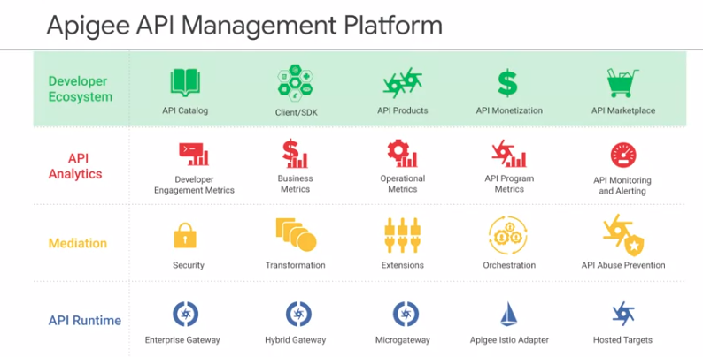
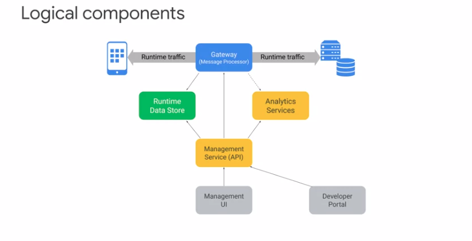
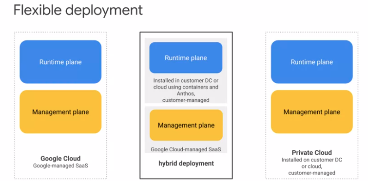
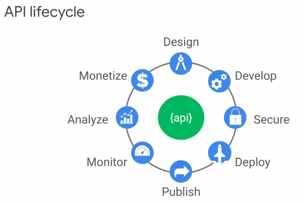
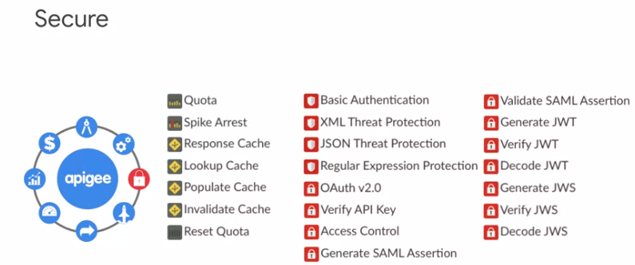
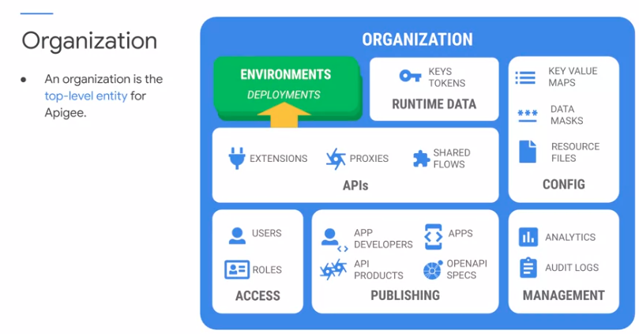
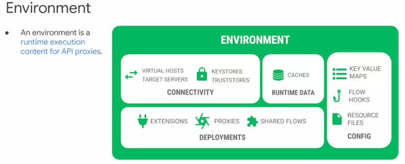

# API Design and Fundamentals of Google Cloud's Apigee API Platform

## Overview of API Lifecycle.

- Apigee's API Management Platform is designed to bridge the gap. By building APIs for connected experiences, you can create abstraction layers that help reduce the complexity requiered of backend systems.

  

- APIs that are implemented on APiGee leverage a rich set of capabilities and futures, including security, caching, transformation, and mediation.

- The real boundary of a company's control over enforcement of policies and management of access to resources ends at the API layer.

- Apigee API Management Platform

- 

- Logical componentes

- The gateway sits in the critical path of runtime traffic.  The gateway's main component is the message processor, which is responsible for  executing APIs in response to API requests.  Data used by APIs during runtime is stored in the runtime data store.  This includes API keys, OAuth tokens, cache, and configuration.  As APIs are executed by a message processor,  analytics events are generated and processed asynchronously.  These events contain a wealth of information about APIs, apps, and backend system calls, and are used for analytics reports and visualization.  The management service facilitates management of this distributed  infrastructure.

- Flexible deployment.

  

- API lifecycle

  

- Start at the top with the design of the API and move clockwise. After the design has been reviewed and approved by stakeholders, you can develop your APIs and build security into them. Your API is launched by deploying it into production and publishing it to app developers. When your API is in production, you must make sure to monitor the health and usage of your API. Analytics can be used to determine your API's level of adoption and how it can be improved. Depending on your business model, it may make sense to monetize your API, charging for its use, or sharing revenue with app developers who are driving new business. With the feedback you receive from your app developers, and the insights you gain from monitoring and analyzing your API program, you will have an understanding of necessary and desired changes.

- Apigee allows you to build your API proxies using policies, which are pre-built functions that can be configured without code. Apigee also has built-in support for JavaScript or Java policies, which allow you to write custom code when needed for more complex use cases. Your proxies can be debugged using Apigee's trace tool, so you can troubleshoot issues during development or in production. Many of Apigee's policies can be used to secure your APIs. You can use traffic management to block excessive traffic or enforce traffic quotas on applications. Apigee has threat protection policies that can be used to detect malicious request payloads and reject them before they're sent to your backend services. Other policies, such as the OAuth policy, allow you to secure your APIs by providing authentication and authorization of applications and their uses. In addition to the security built into your API using policies, Apigee secures your data across the Internet using point-to-point encryption. Apigee provides access control features to help prevent users of your platform from seeing sensitive configuration or user data. With all of its security features, Apigee can be used to create secure APIs, even if your backend services are not fully secured. When your API has been built, you will need to deploy your API proxy into production. 

  

- Companies with public API programs, or those offering digital products to partners, can use Apigee's monetization capability to create revenue streams based on API powered digital products. Apigee Monetization allows you to charge for API usage or share revenue with app developers that drive your business. App developers can easily set up billing, choose rate plans, and process credit card payments from within the developer portal. 

- Organization

  

- An organization contains many types of entities. Some entities live inside environments, which are runtime execution contexts for your APIs. Let's quickly review organization and environment entities.
  Reproduce el video desde 
  Users can be granted access to one or more organizations. Users are associated with one or more roles within an organization.
  The role specifies the set of permissions that is granted to a user.
  At least one user must have the built-in Organization Administrator role, which provides superuser access to the organization.
  Other built in roles specify permissions appropriate for other users of Apigee, including operations, business, and API development team members.
  Organization Administrators can create custom roles, which provide finer-grained control over a user's access within an organization.
  In organizations, API proxies are scoped at the organization level.

- APIs are exposed on Apigee by implementing API proxies. These proxies are built using policies, which are pre-built modules that provide features like security, rate limiting, message transformation, or mediation within the request and response flows of your proxy.

- Policies allow your APIs to provide rich functionality without you having to write lots of code.

- Shared flows can be used to combine a set of policies into a common pattern, allowing reuse of proxy logic in multiple APIs.

- Extensions are used within your proxies to simplify access to Google Cloud and other common services.

- API proxies, shared flows and extensions are deployed to environments. API requests are handled by a proxy deployed in a specific environment.

- Environment. Environments provide a runtime execution context for API proxies. A proxy only accepts API requests when deployed to an environment.

  

  

  ## REST API Design

  