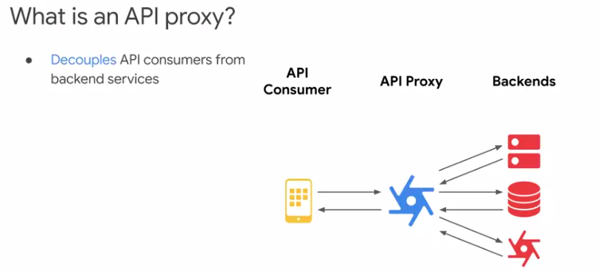
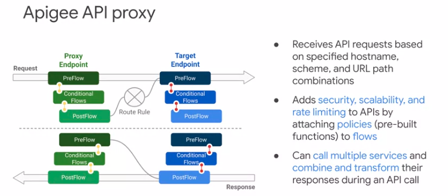
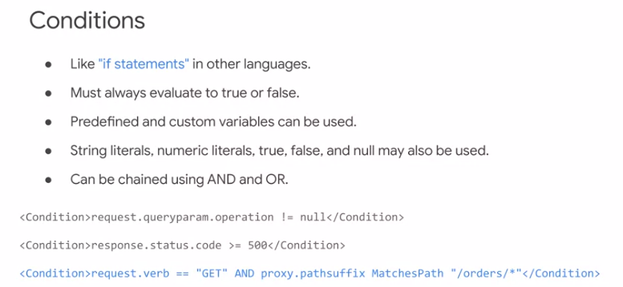

# API Design and Fundamentals of Google Cloud's Apigee API Platform S1.

## Overview of API Lifecycle.

- Apigee's API Management Platform is designed to bridge the gap. By building APIs for connected experiences, you can create abstraction layers that help reduce the complexity requiered of backend systems.

  

- APIs that are implemented on APiGee leverage a rich set of capabilities and futures, including security, caching, transformation, and mediation.

- The real boundary of a company's control over enforcement of policies and management of access to resources ends at the API layer.

- Apigee API Management Platform

- 

- Logical componentes

- The gateway sits in the critical path of runtime traffic.  The gateway's main component is the message processor, which is responsible for  executing APIs in response to API requests.  Data used by APIs during runtime is stored in the runtime data store.  This includes API keys, OAuth tokens, cache, and configuration.  As APIs are executed by a message processor,  analytics events are generated and processed asynchronously.  These events contain a wealth of information about APIs, apps, and backend system calls, and are used for analytics reports and visualization.  The management service facilitates management of this distributed  infrastructure.

- Flexible deployment.

  

- API lifecycle

  

- Start at the top with the design of the API and move clockwise. After the design has been reviewed and approved by stakeholders, you can develop your APIs and build security into them. Your API is launched by deploying it into production and publishing it to app developers. When your API is in production, you must make sure to monitor the health and usage of your API. Analytics can be used to determine your API's level of adoption and how it can be improved. Depending on your business model, it may make sense to monetize your API, charging for its use, or sharing revenue with app developers who are driving new business. With the feedback you receive from your app developers, and the insights you gain from monitoring and analyzing your API program, you will have an understanding of necessary and desired changes.

- Apigee allows you to build your API proxies using policies, which are pre-built functions that can be configured without code. Apigee also has built-in support for JavaScript or Java policies, which allow you to write custom code when needed for more complex use cases. Your proxies can be debugged using Apigee's trace tool, so you can troubleshoot issues during development or in production. Many of Apigee's policies can be used to secure your APIs. You can use traffic management to block excessive traffic or enforce traffic quotas on applications. Apigee has threat protection policies that can be used to detect malicious request payloads and reject them before they're sent to your backend services. Other policies, such as the OAuth policy, allow you to secure your APIs by providing authentication and authorization of applications and their uses. In addition to the security built into your API using policies, Apigee secures your data across the Internet using point-to-point encryption. Apigee provides access control features to help prevent users of your platform from seeing sensitive configuration or user data. With all of its security features, Apigee can be used to create secure APIs, even if your backend services are not fully secured. When your API has been built, you will need to deploy your API proxy into production. 

  

- Companies with public API programs, or those offering digital products to partners, can use Apigee's monetization capability to create revenue streams based on API powered digital products. Apigee Monetization allows you to charge for API usage or share revenue with app developers that drive your business. App developers can easily set up billing, choose rate plans, and process credit card payments from within the developer portal. 

- Organization

  

- An organization contains many types of entities. Some entities live inside environments, which are runtime execution contexts for your APIs. Let's quickly review organization and environment entities.
  Reproduce el video desde 
  Users can be granted access to one or more organizations. Users are associated with one or more roles within an organization.
  The role specifies the set of permissions that is granted to a user.
  At least one user must have the built-in Organization Administrator role, which provides superuser access to the organization.
  Other built in roles specify permissions appropriate for other users of Apigee, including operations, business, and API development team members.
  Organization Administrators can create custom roles, which provide finer-grained control over a user's access within an organization.
  In organizations, API proxies are scoped at the organization level.

- APIs are exposed on Apigee by implementing API proxies. These proxies are built using policies, which are pre-built modules that provide features like security, rate limiting, message transformation, or mediation within the request and response flows of your proxy.

- Policies allow your APIs to provide rich functionality without you having to write lots of code.

- Shared flows can be used to combine a set of policies into a common pattern, allowing reuse of proxy logic in multiple APIs.

- Extensions are used within your proxies to simplify access to Google Cloud and other common services.

- API proxies, shared flows and extensions are deployed to environments. API requests are handled by a proxy deployed in a specific environment.

- Environment. Environments provide a runtime execution context for API proxies. A proxy only accepts API requests when deployed to an environment.

  

  

  ## REST API Design

- REST was defined in Roy Fielding's 2000 doctoral dissertation at the University of California, Irvine. At this time, SOAP, or Simple Object Access Protocol, was a popular way to implement APIs. SOAP, however, is not very simple. In order to make an API call using the SOAP protocol, a developer needs to craft a complex XML payload by referencing an even more complex definition document called a WSDL, which stands for Web Services Description Language.

- What is REST?

  - REST is an architectural style, not a standard.

  - REST APIs typically adhere to common web HTTP concepts.

  - Message payloads generally use JSON (Javascript Object Notation).

  - REST is currently the most common style of web API.

  - APIs that follow the REST architectural style are called RESTful. When an API is designed using the REST style, we call it a RESTful API. RESTful APIs are resource-oriented, focusing on the resources being acted upon instead of focusing on a list of operations or actions.

    

## API-First Design and OpenAPI Specifications

- API-first development is a strategy where your APIs are designed by first focusing on the needs of the app developers who will consume your APIs. 
- API-first development recognizes that your app developers will be most effective if those APIs are crafted specifically for their needs. Traditional API development has often been driven by inside-out thinking: build services first and then worry about how to expose them to the customer.

- API-first benefits:
  - Shake out issues early: uncover business and technical gaps.
  - Promote consistency, usability, and best practice designs.
  - Increase ability to do parallel development.

## API Proxies

- What is a proxy? An intermediary acting on behalf of something or someone else.
- What is an API proxy? An API proxy provides a facade layer that separates API consumers, typically applications, from backends, services, and resources. The API consumer does not connect directly to those backend services. Instead, the API consumer connects to the API proxy, and the API proxy provides the required functionality by calling the backend services. The proxy provides consumer-facing APIs. These APIs can be designed specifically to address the needs of app developers and their apps. The advantage of this decoupling is that app developers do not need to worry about the complexity or usage patterns of backend services. The API proxy itself can deal with authentication, authorization, data manipulation, removing sensitive data, and other related concerns. Your backends can all use different API patterns or methods of access, and the API proxy can avoid passing that complexity on to app developers. This pattern also allows us to make changes in our backends, such as modernizing backend services or moving services from a data center to the cloud, all without having any effect on the apps that are using the proxy APIs.

- The proxy receives API requests from the app consuming the API. A particular proxy receives that request based on the scheme, hostname and URL. An API developer can add features like security, scalability, and rate-limiting to API proxies by attaching policies to flows. 

- An Apigee API proxy is split into two parts: the proxy endpoint and the target endpoint. The proxy endpoint is on the left of the diagram, closer to the API consumer. The target endpoint is on the right of the diagram, closer to the backend service, which is also called the target. The proxy developer attaches policies to flows to build the API proxy's functionality.

  

- But what about the extra network hop?

  - when you add this layer:
    - You gain control and insight.
      - Verify security tokens and enforce security policies.
      - Perform traffic management and serve requests from cache.
      - Collect analytics and gain insight into API usage and performance.
    - You decouple API consumers from backend services.
      - Create APIs that combine backend and third-party services.
      - Innovate in consumer-facing APIs without affecting backend services.
      - Modernize and move backends without breaking consumer apps.

- The concerns of the API consumer are generally handled by the proxy endpoint. An incoming request is sent to a specific proxy based on the protocol, host alias, and base URL of the request. The proxy endpoint parses and validates the request. Policies are usually attached in the proxy endpoint request to rate limit traffic and protect against invalid and malicious requests, blocking the requests from reaching the backend service. The proxy endpoint also typically builds the API response to be sent back to the caller. The target endpoint handles the calling of the backend service. The URL of the backend service is specified in the target endpoint. The target endpoint generally builds a request for calling the backend service.

## Proxy Endpoints and Virtual Hosts

- Apigee API gateways handle your runtime API traffic. There are typically many API proxies running on a single Apigee gateway, and Apigee must be able to route traffic to the correct proxy. An Apigee gateway can host traffic for multiple organizations.
- Multi-tenancy
  - A single gateway can host traffic for multiple organizations.
  - Each organization can have multiple environments.
  - Each environment can receive traffic for multiple protocols (http/https), host aliases (domain names like api.apigee.org), and port numbers (80/443/others)
- Virtual hosts
  - Host multiple host aliases (domain names) on a single server.
  - A virtual host contains: { Virtual host name, One or more host aliases, A protocol (http or https), A port number, Certificate details (if https) }
  - Combination of host alias, protocol, and port number must be unique across all organizations and environments.
- The **virtual host** determines the organization and environment to receive the traffic. A base path is configured in a proxy endpoint to indicate their requests starting with the base path should be routed to that endpoint. The base path is the first part of the URL following the host alias.
- A **proxy endpoint** specifies one or more virtual host names in a single base path. API requests that match a specified virtual host and the specified base path will be routed to that proxy endpoint. Note that you could have multiple proxy endpoints that match an API request, with each endpoint having a different base path. 
- A proxy cannot be deployed unless the combination of virtual host and base path for each proxy endpoint is unique within the environment. A proxy endpoint is configured using XML. The HTTPProxyConnection tag in the proxy endpoint contains a single base path and one or more virtual hosts. Any requests matching one of the virtual hosts and the base path will be routed to this proxy endpoint. 

- Within a specific organization, many proxies are deployed to a given environment. Proxies typically have just one proxy endpoint, but they may have more than one. A proxy endpoint is the entry point into a proxy for an API call.

  

## Conditions, Flows, and Policies.

- Apigee API proxies allow the use of variables. Variables can be used to control the functionality of your proxies. Apigee has predefined variables that are set for each API call. Some variables give us information about the incoming request. 

  

- The variables set by policies will be used to customize the flow and behavior of your APIs. An example of a variable that you will use quite often is proxy.pathsuffix. proxy.pathsuffix is automatically set to the part of the incoming URL following the base path, not including the query parameters. For a RESTful API, the request's proxy path suffix and verb indicate the operation being performed. 

  

- **Conditions** allow dynamic handling during API calls. Conditions are like if statements in other programming languages, and must always evaluate to true or false. Variables and literals may be used conditions, and conditions may be chained using the AND and OR operators. 

  

- Apigee also has multiple **pattern matching** operators.

  

- **API proxy flows.** The evaluation order of flows is as follows. When the API request is received by the proxy endpoint, it is first handled by the proxy endpoint request flows. It is here that the request is typically validated and parsed. Next, route rules are evaluated to determine which target, if any, should continue with the processing. 

  Next, the target endpoint request flows are processed. The request to be sent to the backend is generally built in these flows. Next, the request is sent to the backend target service, which returns a response. The next set of flows to handle processing is the target endpoint response. We generally parse the backend response here.

  Finally, processing continues to the proxy endpoint response. It is here we typically build the API response and log any necessary information. After these flows, the response is returned to the API consumer.

  

- **Policies** are pre-built modules that implement specific functionality. They allow features like security, rate-limiting, and payload manipulation. These features are controlled using simple XML configuration and without writing any code. However, when you need code for a complex use case, there are also policies that allow you to run custom code. A policy can also be conditionally executed. If the condition for a policy evaluates to false, policy execution is skipped.

- Policies are created within a proxy. Each policy contains its own configuration written in XML. Proxies can contain multiple policies of the same policy type, and a policy can be attached to one or more flows within a proxy. When a policy is attached to a flow, it is called a step. Each step can be associated with a condition. If the condition evaluates to true, the policy is executed during the step. When a flow is run, steps are evaluated in order. The diagram shows the proxy endpoint request flows. The policies are shown at the bottom. They are attached to flows as steps. When an API call comes in, the steps in the PreFlow would be run in order, followed by steps in the first matching conditional flow, if any, and ending with any steps in the PostFlow. 

  

- The policy type is shown in the policy definition, not the flow. One common convention for a policy name is to use an abbreviation for the policy type, followed by a descriptive name separated by a hyphen. The policy type is usually not enough information to understand what the policy is meant to do.

  

