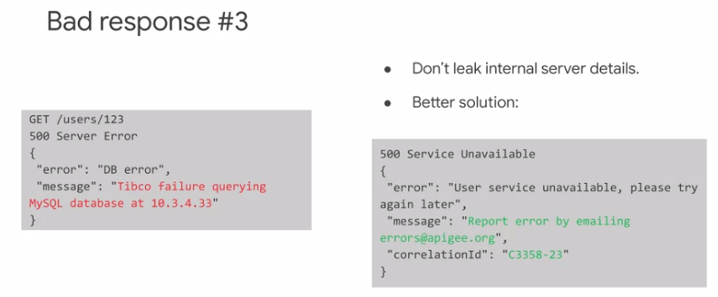

# API Design and Fundamentals of Google Cloud's Apigee API Platform S2.

## API Products.

- what is a product? In Apigee, an API product is a bundle of APIs. These APIs are typically packaged together with the needs of application developers and applications in mind. 

- What is an API product?

  - Bundle of APIs.
  - Controls access to APIs.
  - Use for access or service levels
    - read-only/read-write
    - internal/public
    - free/standars/premium

- Publishing APIs

  

## API Product Strategies.

- Products, on the other hand, focus on the outcome, not the delivery. While a project is often represented by a scheduled list of activities that are required to solve the problem, products should be designed based on business requirements. The person or team designing a product may have no idea how the product will be implemented, but that's okay. A product focus will be more likely to lead to a successful outcome since we are focusing on the requirements of the API product rather than the process used to create it. Products also need to adapt to market needs as they change. This means that we should be willing to modify our product over time. It can also mean that the new product you envisioned a few months ago might not be what you need now. This is one of the problems we often see with IT projects. When we design large projects upfront for delivery months later, the team locks down requirements to avoid scope creep and give the team a chance to meet the delivery date, but the project often has reduced value when it is eventually delivered. The need to have a product meet current business requirements means that products do not have a completion date. We're not saying that you'll never deliver a product.

  

## REST API Design

- Status code should be used as the primary signal indicating whether an operation succeeded or failed.
- Status
  - Primary signal for success or failure.
  - Have specific meanings.
  - Should be consistent across your API.
- Common status codes.
  - **200** ok. his means that the request was successful, the resource was found, and the requested action was taken. 
  - **400** Bad request. The request made by the client didn't satisfy one or more requirements. 
  - **401** Unauthorized. This actually means that the call requires authentication and the user has not successfully authenticated. This reason phrase is slightly confusing since the error indicates a lack of authentication not authorization.
  - **403** Forbidden. In this case, the user has successfully authenticated, but the user is not allowed to perform the request for the specified resource or resources. 
  - **404** Not Found. For REST APIs, 404 means that the resource specified in the URL does not exist, or at least is not accessible to the current user.
  - **429** Too Many Requests. This error is returned when the request is being rejected because the user, or all users, have made too many requests recently. We will see that this error is used by Apigee for the SpikeArrest and Quota policies; more on those policies later.
  - **500** Server error. This should be used for an unexpected error on the server side. The expectation is that the caller might try the request again at a later time. Many, if not most of the REST APIs you use or create should return these status codes. 
  - **201** Created. Like 200 OK. this status code indicates success. It is used when a resource is successfully created, generally using a POST. 
  - **204** No Content. 204 is a success code that indicates that there is no content to return in the response payload body. The request was successful, but there is nothing for the API to return. 
  - **304** Not Modified.  is a success code that indicates that the version of the resource the caller already has is the most up-to-date version, so no payload response is necessary. This can be returned when you use cache headers. 
  - **405** Method Not Allowed. This should be returned when the resource being requested is valid, but the requested verb isn't allowed for the resource. 
  - **406** Not Acceptable. This should be returned when an incoming Accept header is asking for a response format that is not supported by the API.
  - **409** Conflict. could be returned if the resource was changed after the original read. 
  - **503** Service Unaviable. This may be used when a service is temporarily unable to handle the request; for example, the service is down for maintenance. This should be used when the error is known to be temporary and service will be restored.
- Status code ranges
  - HTTP status code ranges have specific meanings:
    - 1XX - Informational.
    - 2XX - Success.
    - 3XX - Redirection.
    - 4XX - Client Error.
    - 5XX - Server Error.

### Bad response

- Pagination
  - Page through ordered results.
  - Use for searches or queries.
  - Use for large or unknown number of results.

