# comparison


### 01. Comparative adjectives.

Comparative adjectives are used to compare differences between the two objects they modify (larger, smaller, faster, higher). They are used in sentences where two nouns are compared, in this patter:

```text
Noun(subject) + verb + comparative adjective + than + noun(object).
```


*The second item of comparison can be omitted if it is clear from the context.

> ​	**Examples:**
>
> - My house is larger than her.
> - This box is smaller that the one I lost.
> - You dog runs faster than Jim's dog.
> - The rock flew higher that the roof.
> - Jim and Jack are both my friends, but I like Jack better.
> - She's younger than me.
> - This exercise is more difficult than the last one.
> - David looks older than he really is.


### Superlative adjectives.

Superlative adjectives are used to describe an object which is at the upper or lower limit of a quality ( the tallest, the smallest, the fastest, the highest). They are used in sentences where a subject is compared to a group ob objects.

```
Noun(subject) + verb + the + superlative adjective + noun (object).
```

> **Examples**:
>
> - My house is the largest one in our neighborhood.
> - This is the smallest box I've ever seen.
> - Your dog ran the fastest of any dog in the race.
> - We all threw our rocks at the same time. My rock flew the highest.


### Forming regular comparatives and superlatives

Forming comparatives and superlatives is easy. The form depends on the number of syllables in the original adjective.

**One syllable adjectives**

Add ***-er*** for the comparative and ***-est*** for the superlative. If the adjective has a consonant + single vowel + consonant spelling, the final consonant must be doubled before adding the ending.

| Adjectives     | Comparative | Superlative |
| -------------- | ----------- | ----------- |
| tall           | taller      | tallest     |
| fat            | fatter      | fattest     |
| big            | bigger      | biggest     |
| sad (*triste*) | sadder      | saddest     |
| cheap          | cheaper     | cheapest    |

**Two syllables adjectives**

Adjectives with two syllables can form the comparative either by adding ***-er*** or by preceding the adjective with ***more***. These adjectives form the superlative either by adding ***-est*** or by preceding the adjective with ***most***. In many cases, both forms are used, although one usage will be more common than the other. If you are not sure whether a two-syllable adjective can take a comparative or superlative ending, play it safe and use *more* and *most* instead. For adjectives ending in *y*, change the y to an i before adding the ending.

| Adjective            | Comparative  | Superlative  |
| -------------------- | ------------ | ------------ |
| happy                | happier      | happiest     |
| simple               | simpler      | simplest     |
| busy                 | busier       | busiest      |
| tilted (*inclinado*) | more tilted  | most tilted  |
| tangled (*enredado*) | more tangled | most tangled |

**Three or more syllables**

Adjectives with three or more syllables from comparative by putting more in front of the adjective, and the superlative by putting most in front.

| Adjective | Comparative    | Superlative    |
| --------- | -------------- | -------------- |
| important | more important | most important |
| expensive | more expensive | most expensive |

**Irregular comparatives and superlatives**

| Adjetive | Comparative       | Superlative         |
| -------- | ----------------- | ------------------- |
| good     | better            | best                |
| bad      | worse             | worst               |
| little   | les               | least               |
| much     | more              | most                |
| far      | further / farther | furthest / fasthest |

> **Examples:**
>
> - Today is the **worst** day I've had in a long time.
> - You play tennis **better** than I do.
> - This is the **least** expensive sweater in the store.
> - This sweater is **less** expensive than that one.
> - I ran pretty far yesterday, but I ran even **farther** today.


### Others

When you want to say something is similar, use ***'as - as'***

> She's as tall as her brother.
>
> It's as nice today as it was yesterday. (Hoy es tan bonito como ayer)

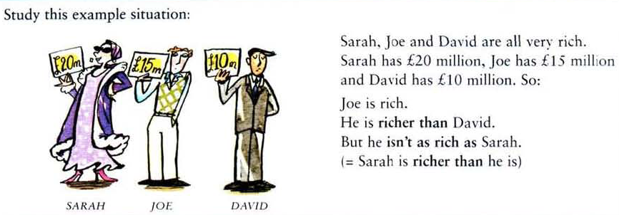

You can use “almost as … as”, “not quite as … as”, “(not) nearly as … as”, “nowhere near as … as”, “twice as … as” and “half as … as” to change the extent of the similarity.

> **Examples:**
>
> - She's almost as good as you! (Ella es casi tan buena como tú!)
> - He's not quite as confident as Susie (No tiene tanta confianza como Susie)
> - I'm not nearly as intelligent as her! (No soy tan inteligente como ella)
> - This painting is nowhere near as famous as the first. (Esta pintura no estan famosa como la priemra)
> - She's twice as old as him (Tiene el doble de edad que él)
> - He's half as interesting as you! (Es la mitad de interesante que tú)

Before comparatives, you can use:

```
much   -   a lot   -   far (=a lot)   -   a bit   -   a little   -   slightly (=a little)
```

> **Examples:**
>
> - Let's go by car. It's much cheaper.
> - How do you feel? Much better, thanks.
> - Don't go by train. it's a lot more expensive.
> - Could you speak a bit more slowly?
> - This bag is slightly heavier than the other one.
> - Her illness was far more serious than we thought at first.

You can use any and no + comparative (any longer/ no bigger etc)

> **Examples:**
>
> - I've waited long enough. I'm not waiting any longer.
> - We expected their house to be very big, but it's no bigger than ours.
> - How do you feel now? Do you feel any better?
> - This hotel is better than the other one, and it's no more expensive.

We repeat comparatives to say that something changes continuously.

> **Examples:**
>
> - Your English is improving. It's getting better and better.
> - The city is growing fast. It's getting bigger and bigger.
> - Cathy got more and more bored in her job. In the end she left.
> - There days more and more people are learning English.

### Exercises

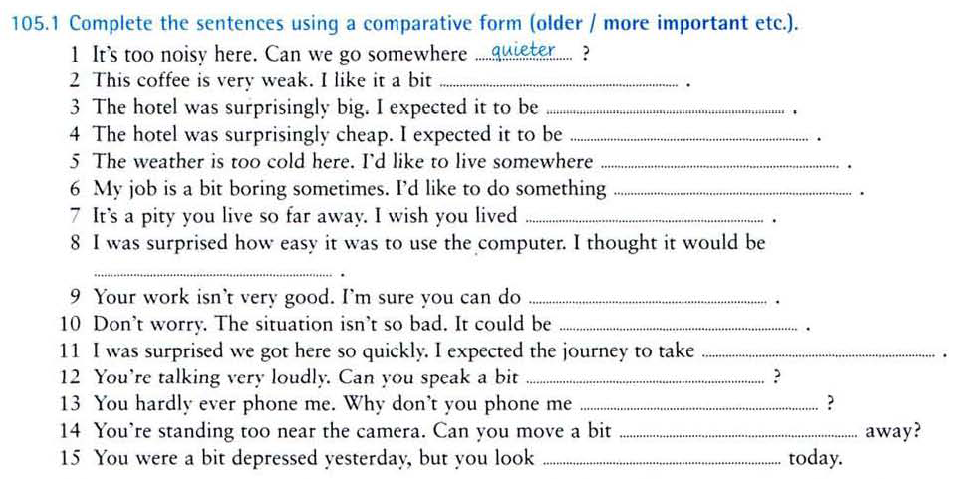

| 1. quieter        | 6. more interesting | 11. longer       |
| ----------------- | ------------------- | ---------------- |
| 2. stronger       | 7. nearer           | 12. more quietly |
| 3.  smaller       | 8. more difficult   | 13. more often   |
| 4. more expensive | 9. better           | 14. further      |
| 5. hotter         | 10. worse           | 15. happier      |

- very loudly (muy fuerte) 
- more quitly (más tranquilamente)
- you hardly ever phone me. (Casi nunca me llamas por teléfono)


#### Unit 105. (cheaper, more expensive etc.)

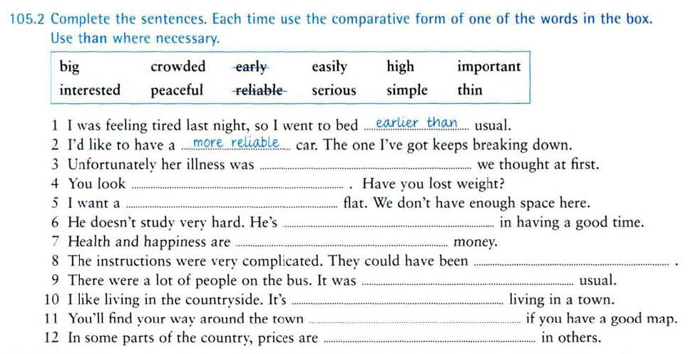

| 3. more serious than | 6. more interested     | 9. more crowded than |
| -------------------- | ---------------------- | -------------------- |
| 4. thinner           | 7. more important than | 10. more peaceful    |
| 5. bigger            | 8. simpler             | 11. higher than      |

- Crowded (abarrotado, concurrido, lleno)

  

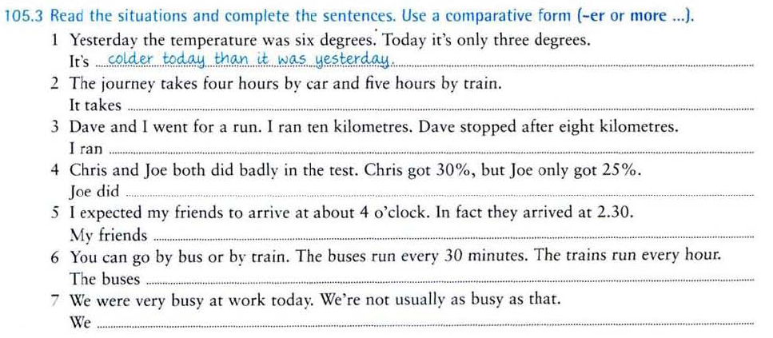

2. It takes longer by train than by car.
3. I ran further than Dave.
4. Joe did worse than Chris in the test.
5. My friends arrived earlier than I expected.
6. The buses run more often/more frequently than the trains.
7. We were busier than usual at work today.


#### Unit 106 (much better / any better/ better and better / the sooner the better)

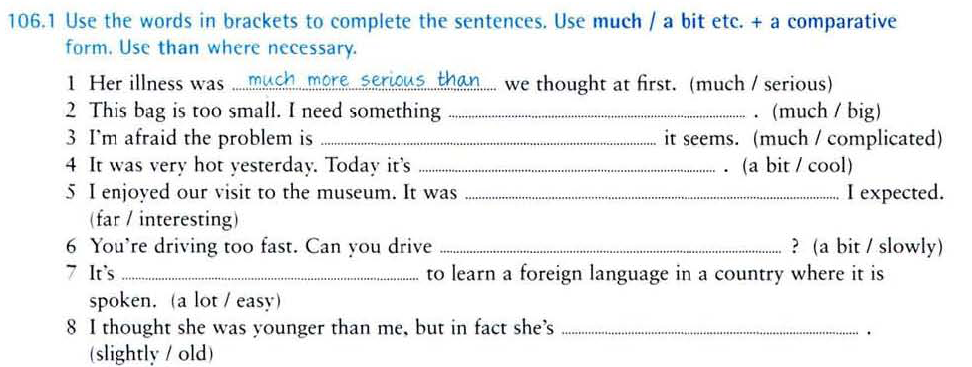

| 2. much bigger                | 4. a bit cooler              | 6 a bit more slowly |
| ----------------------------- | ---------------------------- | ------------------- |
| 3. much more complicated than | 5. far more interesting than | 7. slightly older   |


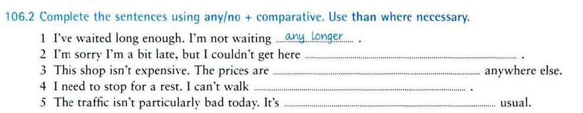

| 2. any earlier    | 4. any further   |
| ----------------- | ---------------- |
| 3. no higher than | 5. no worse than |

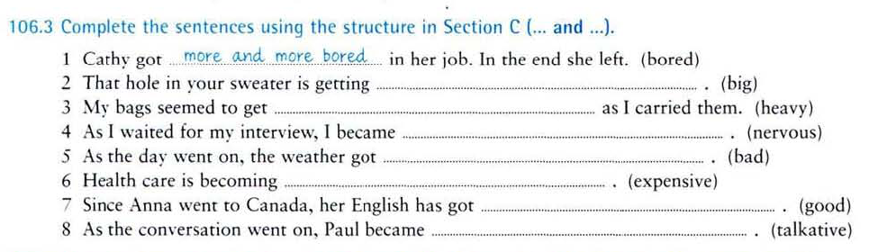

| 2. bigger and bigger     | 6. more and more expensive            |
| ------------------------ | ------------------------------------- |
| 3. heavier and heavier   | 7. better and better                  |
| 4. more and more nervous | 8. more and more talkative (hablador) |
| 5. worse and worse       |                                       |


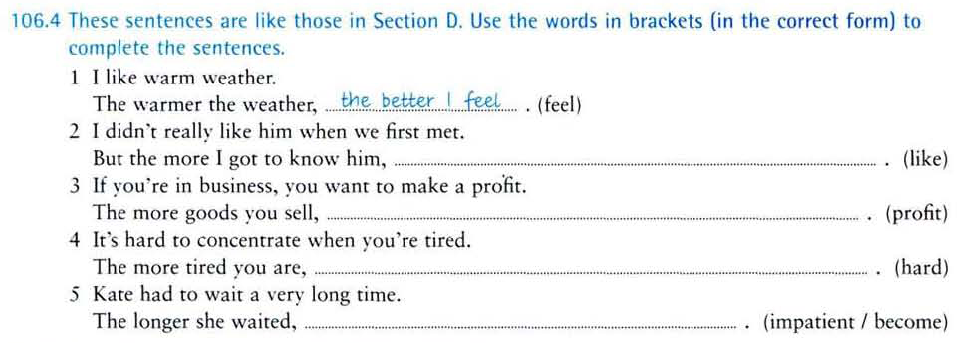

| 2. the more I liked him     | 4. the harder it is to concentrate |
| --------------------------- | ---------------------------------- |
| 3. the more profit you make | 5. the more impatient she became   |


#### Unit 107. (as ... as / than)

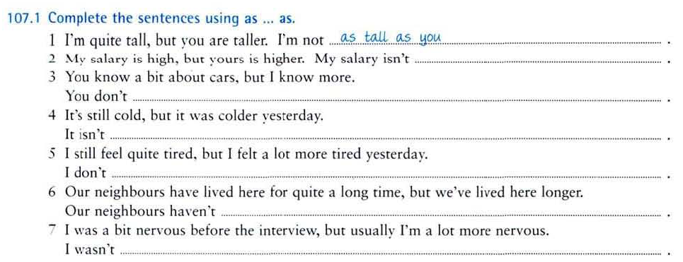

2. My salary isn't as high as yours.

3. You don't know as much about cars as me.
4. It isn't as cold as it was yesterday.
5. I don't feel as cold as it was yesterday.
6. Our neighbours haven't lived here as long as us.
7. I wasn't as nervous as I usually am.

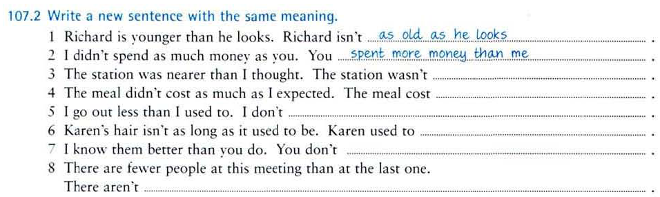

3. The station wasn't as far as I thought.
4. The meal cost less than I expected.
5. I don't go out as much as I used to.
6. Karen used to have longer hair.
7. You don't know them as well as me.
8. There aren't as many people at this meeting as at the last one.


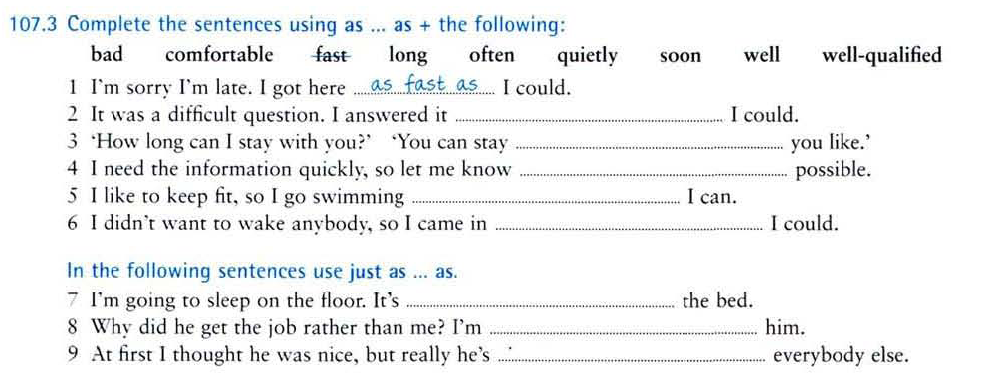

| 2. as well as | 5. as often as            | 8. just as well-qualified |
| ------------- | ------------------------- | ------------------------- |
| 3. as long as | 6. as quietly as          | 9. just as bad as         |
| 4. as soon as | 7. just as comfortable as |                           |

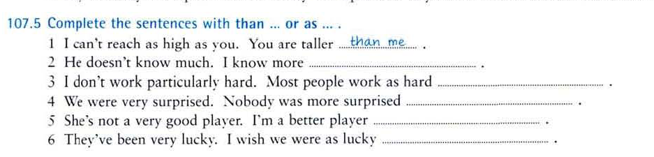

| 2. than him / than he does | than her / than she is      |
| -------------------------- | --------------------------- |
| 3. as me / as I do         | as them / as they have been |
| 4. than us / as I do       |                             |


#### Unit 8 Superlatives

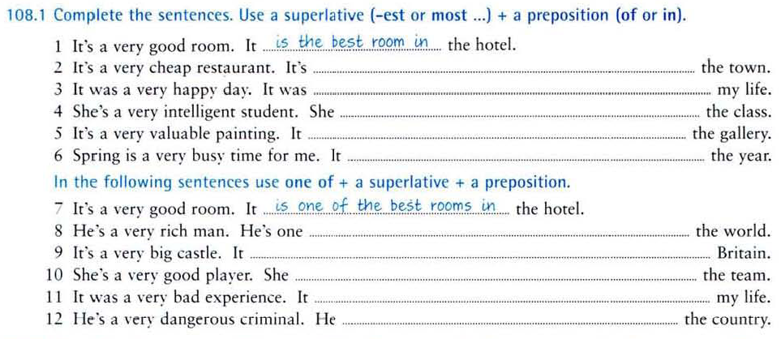

2. It's the cheapest restaurant in the town.
3. it was the happiest day of my life.
4. She's the most intelligent student in the class.
5. It's the most valuable painting in the gallery.
6. It's the busiest time of the year.

8. He's one of the richest men in the world.
9. It's one of the biggest castles in Britain.
10. She's one of the best players in the team.
11. It was one of the worst experiences of my life.
12. He's one of the most dangerous criminals in the country.


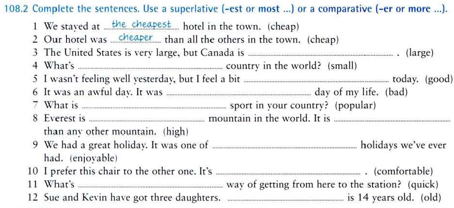

| 3. larger                                                    | 9. the most enjoyable |
| ------------------------------------------------------------ | --------------------- |
| 4. the smallest                                              | 10. more comfortable  |
| 5. better                                                    | 11. the quickest      |
| 6. the worst                                                 | 12. The oldest        |
| 7. the most popular                                          |                       |
| 8. ..the highest mountain in the world ... It is higher than ... |                       |

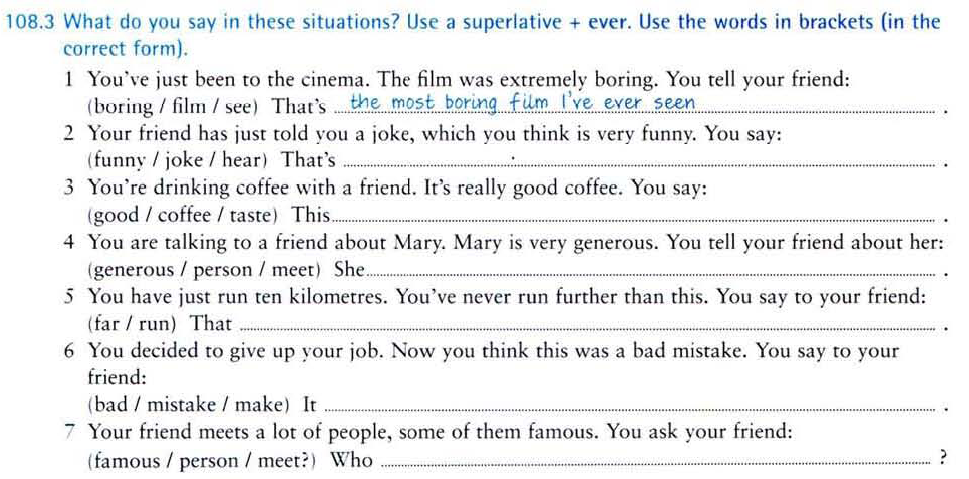

2. That's the funniest joke I've ever heard.
3. This is the best coffee I've ever tasted.
4. She's the most generous person I've ever met.
5. That's the furthest I've ever run.
6. It's the worst mistake I've ever made.
7. Who's the most famous person you've ever met?.


## Resources

- https://www.ef.com/wwen/english-resources/english-grammar/comparative-and-superlative/
- https://www.english-at-home.com/grammar/comparisons/
- Book: Murphys intermediates.