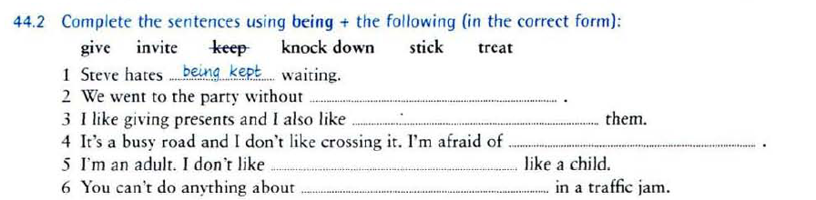

# Passive

## Introduction

The passive of an active tense is formed by putting the verb **"to be"** into the same tense as the active verb and adding the past participle of the active verb. The subject of the active verb becomes the 'agent' of the passive verb. The agent is very often not mentioned. When it is mentioned it is preceded by **"by"** and placed at the end of the clause.

- Active: My grandfather planted this tree.
- Passive: This tree was planted by my grandfather.

**Short answers** 

To make short answers: 

- we use the verb to be (am/is/are/was/were) for Present Simple, Past Simple, Present Continuous, Past Continuous and Going To questions. 
- we use the verb have (have/has/had) for Present Perfect and Past Perfect questions. 
- we use will for Future Simple questions.

**USE**

The Passive is used: 

1. when the agent (=the person who does the action) is unknown, unimportant or obvious from the context. 

   ​	Jane was shot. (We don’t know who shot her.) 

   ​	This church was built in 1815. (Unimportant agent) 

   ​	He has been arrested. (Obviously by the police) 

2. to make more polite or formal statements. 

   ​	The car hasn’t been cleaned. (more polite) (You haven’t cleaned the car. – less polite) 

3. when the action is more important than the agent, as in processes, instructions, events, reports, headlines, new items, and advertisements. 

   ​	30 people were killed in the earthquake.

4. to put emphasis on the agent.

   ​	The new library will be opened by the Queen

   

**BY OR WITH?** 

In the passive voice, we use:

- by with the agent to refer to by whom the action is being done. 

  ​	The door was opened by Mr Black. (Mr Blak = agent)

- with to refer to the instrument, object or material that was used for something to be done. 

  ​	The door was opened with a key. (a key = the object that was used) 

  ​	The omelette was made with eggs, cheese and peppers. (eggs, cheese and peppers = the 	material 	that was used)

**EXAMPLES**

- Our house was designed by a famous architect.
- Our car was stolen last night. (We don’t know who stole it)
- He has been taken to hospital. (What we are interested in is the fact that he has been taken
  to hospital and not who has taken him.)
- The murderer was arrested last night. (It is not necessary to mention that he has been
  arrested by the police because it is self-evident.)
- Someone broke the window. → The window was broken.
- This book was written by Agatha Christie.

## is done / was done

## be done / been done / being done

### Theory

### Exercise

**43.1 What do these words mean? Use it can ... or it can't ....**

1. ***washable,*** It can be washed
2. **unbreakable,** *it* can't be broken  (I can't break it // nobody can break it)
3. ***edible***, it can be eaten
4. ***unusable***, it can't be used
5. ***invisible***, it can't be seen 
6. ***portable***, it can be carried

3. A decision will not **be made** until the next meeting

4. Do you think that more money should **be spent** on education?

5. This road is very bad condition. It should **have been repaired** a long time ago.

6. The injured man couldn't walk and had to **be carried**.

7. It's not certain how the fire started, but it might **have been caused** by an electrical fault.

8. I told the hotel receptionist I wanted to **be woken up** at 6.30 the next morning.

9. If you hadn't pushed the policeman, you wouldn't **have been arrested**.

2. The meeting has been postponed.

3. The computer is being used at the moment

4. I didn't realise that our conversation was being recorded.

5. ... we found that the game had been cancelled.

6. A new ring road is being built round the city.

7. A new hospital has been built near the airport.

3. It's been stolen / It has been stolen!

4. Somebody has taken it.

5. He's been promoted. / He has been promoted.

6. It's being redecorated. / It is being redecorated.

7. It's working again. / It's been repaired. / It has been repaired.

8. The furniture had been moved.

9. He hasn't been seen since then.

10. I haven't seen her for ages.

11. Have you ever been mugged?

### Theory

### Exercise

2. I was asked some difficult questions at the interview.

3. Linda was given a present by her colleagues when she retired.
4. I wasn't told about the meeting.
5. How much will you be paid for work?
6. I think Tom should have been offered the job.
7. Have you been shown what to do?

1. being kept
2. being invited
3. being given
4. being knocked down
5. being treated
6. being stuck

1. Walt Disney was bornin 1901.
2. Beethoven was born in 1770.
3. Agatha Christie was born in 1890.
4. Galileo was born in 1564.
5. Mahatma Gandhi was born in 1869
6. Martin Luther King was born in 1929
7. Elvis Presley was born in 1929
8. Leonardo da vici was born in 1452
9. William Shakespeare was born in 1564
10. I was bor in 1980

1. get hurt (ser herido)
2. et stung (ser picado)
3. get used (ser utilizado)
4. got stolen (ser robado)
5. get paid (que le paguen)
6. got stopped (ser detenido)
7. got damaged (ser dañado)
8. get asked (ser preguntado)

## EXAMPLES

- BMW’s – make – in Germany (PRESENT SIMPLE) 
  - BMW’s are made in Germany.
- English – speak – in this shop (PRESENT SIMPLE) 
  - English is spoken in this shop. 
- The oldest house – build – in 1575 (PAST SIMPLE) 
  - The oldest house was built in 1575. 
- The bridge – repair – at the moment (PRESENT CONTINUOUS) 
  - The bridge is being repaired at the moment. 
- The trees – cut down – last winter (PAST SIMPLE) 
  - The trees were cut down last winter. 
- The picture – paint – tomorrow (FUTURE SIMPLE) 
  - The picture will be painted tomorrow. 
- When I came in – the TV – fix (PAST CONTINUOUS) 
  - When I came in , the TV was being fixed. 
- The cupboard – repair – recently (PRESENT PERFECT SIMPLE) 
  - The cupboard has been repaired recently.
- The car – find – in the garage (PAST SIMPLE) 
  - The car was found in the garage. 
- Breakfast – serve – between 7 and 9 (PRESENT SIMPLE) 
  - Breakfast is served between 7 and 9. 
- The dog – call- Rover (PRESENT SIMPLE) 
  - The dog is called Rover 
- The meeting – hold – in my office (PAST CONTINUOUS) 
  - The meeting was being held in my office. 
- The street – close – because of snow (PRESENT PERFECT) 
  - The street has been closed because of snow. 
- The banks – close – in two days (FUTURE – SIMPLE) 
  - The banks will be closed in two days. 
- Hundreds of books – write – every year (PRESENT SIMPLE) 
  - Hundreds of books are written every year. 
- After the accident – Joe – take – to the hospital (PAST SIMPLE) 
  - After the accident Joe was taken to the hospital. 
- The cap – find – in the corner (PAST SIMPLE) 
  - The cap was found in the corner. 
- The robber – not find – by the police – yet (PRESENT PERFECT) 
  - The robber has not been found by the police. 
- The search – stop – this evening (FUTURE SIMPLE) 
  - The search will be stopped this evening. 
- Different types of cameras – use (PRESENT CONTINUOUS) 
  - Different types of cameras are being used. 

- Many people begin new projects in January 
  - New projects are begun in January. 
- You must wash that shirt for tonight’s party. 
  - That shirt must be washed for tonight’s party. 
- Mum is going to prepare the food. 
  - The food is going to be prepared by mum. 
- They make shoes in that factory. 
  - Shoes are made in that factory. 
- We will have to examine you again. 
  - You will have to be examined again.
- They had finished preparations by the time the guests arrived. 
  - Preparations had been finished by the time the guests arrived. 
- The delegation will meet the visitors at the airport. 
  - The visitors will be met at the airport by the delegation 
- We have produced skis here since 1964. 
  - Skis have been produced here since 1964.  
- All workers will read the memo. 
  - The memo will be read by all workers. 
- Nobody can beat Tiger Woods at golf. 
  - Tiger Woods cannot be beaten at golf. 
- They also speak German at EU meetings. 
  - German is also spoken at EU meetings. 
- We must look into the question. 
  - The question must be looked into. 
- Someone reads the newspaper to him every day. 
  - The newspaper is read to him every day. 
- The Chinese discovered acupuncture thousands of years ago. 
  - Acupuncture was discovered by the Chinese thousands of years ago. 
- Has he given you back the book yet? 
  - Has the book been given back to you yet? Have you been given back the book yet? 
- The police locked up the criminals. 
  - The criminals were locked up by the police. 
- They must have left the keys behind. 
  - The keys must have been left behind. 
- The robbers made up the story. 
  - The story was made up by the robbers. 
- The boy is eating the cake. 
  - The cake is being eaten by the boy 
- Dad promised by a box of chocolates. 
  - I was promised a box of chocolates. 
- The spider scared her. 
  - She was scared by the spider. 
- The guide will show us the Natural History Museum in the afternoon. 
  - We will be shown the Natural History Museum by the guide in the afternoon The Natural History Museum will be shown to us in the afternoon. 
- The dentist is cleaning the woman’s teeth. 
  - The woman’s teeth are being cleaned by the dentist. 
- She showed her relatives the new house. 
  - Her relatives were shown the new house.

## Resources

- https://inglescarmelitaslb.files.wordpress.com/2011/03/the-passive-voice1.pdf
- https://www.english-grammar.at/worksheets/passive_voice/pv4.pdf
- https://www.e-grammar.org/passive-voice/