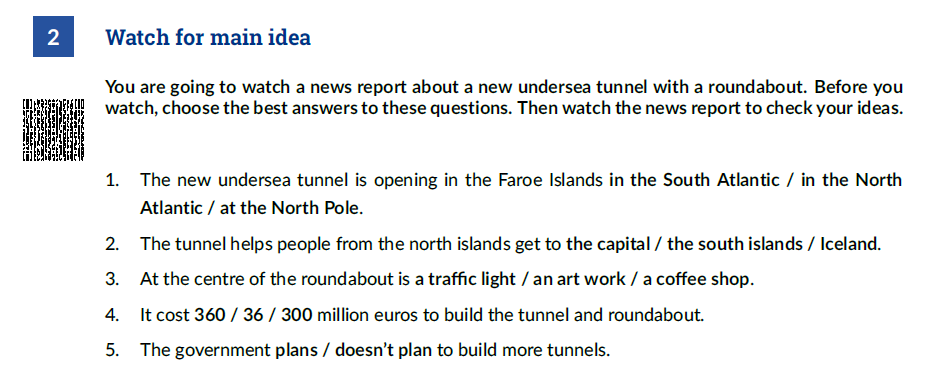
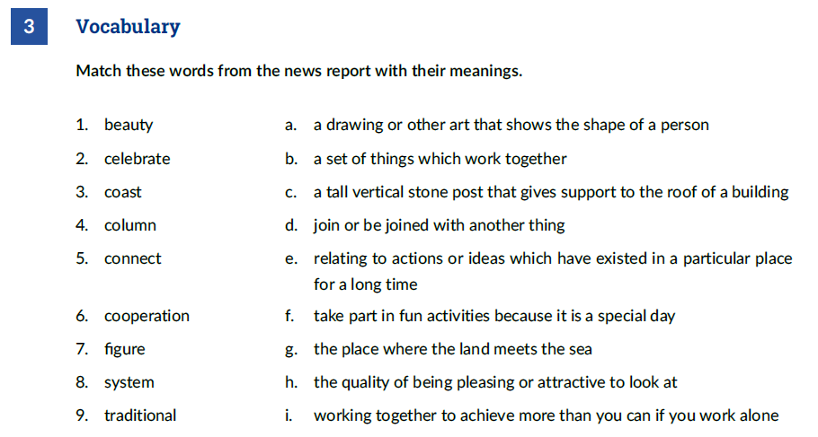
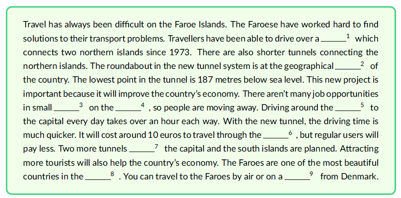

# Undersea Tunnel

Resource: [Undersea Tunnel](../docs/undersea-tunnel.pdf)

| 1. in the North Atlantic | 3. an art work | 5. plans |
| ------------------------ | -------------- | -------- |
| 2. the capital           | 4. 360         |          |

|      |      |      |      |      |      |      |      |      |
| ---- | ---- | ---- | ---- | ---- | ---- | ---- | ---- | ---- |
| 1. h | 2. f | 3. f | 4. c | 5. d | 6. i | 7. a | 8. b | 9. e |

### Checking understanding

1. **How long is the tunnel system?**   11 km
2. **Why is using a tunnel better than driving along the coast?**  it saves time
3. **What will the artwork on the central column at the centre of the roundabout show?** It will show figures doing a traditional ring dance. it's a celebration of co-operation. 
4. **Why will people who live in small villages need to use the tunnel (and bridges)?** Because they will want to get to new jobs in the capital city
5. **What is the problem with using ferries to travel between the islands?** Bad weather often stops services
6. **Who else will want to use the tunnel?**   Tourist
7. **Why are the Faroe Islands famous?**  For their natural beauty

### Language point

1. over bridges.
2. at the centre.
3. around the cost
4. between the north islands and the capital.
5. on the islands/ferries
6. through the tunnel
7. in the world / the North Atlantic / small villages

| 1. bridge | 3. villages | 5. coast  | 7. between | 9. ferry |
| --------- | ----------- | --------- | ---------- | -------- |
| 2. centre | 4. islands  | 6. tunnel | 8. world   |          |

